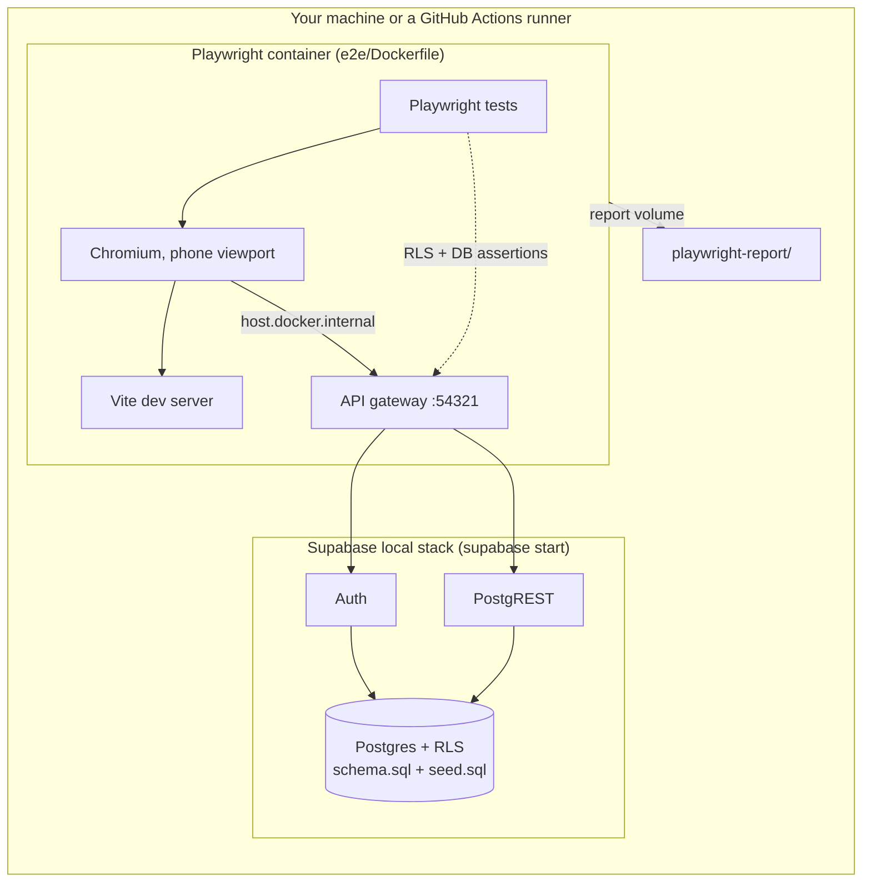
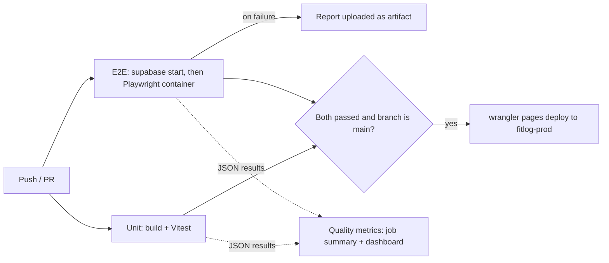

# FitLog

A phone-first Progressive Web App for tracking nutrition, cardio, strength, and body weight — a personal, modern take on the classic MyFitnessPal, built end-to-end with React 19, TypeScript, and Supabase.

**Live app:** [fitlog-9wl.pages.dev](https://fitlog-9wl.pages.dev)

<!-- Add a screenshot or two here — a phone-sized capture of the Diary and Progress views goes a long way. -->

## Overview

FitLog is a single-user, cloud-synced fitness tracker designed mobile-first and installable as a PWA. It covers the full daily loop: logging food against calorie and macro goals, importing whole-food nutrition data from the USDA database, tracking cardio and strength workouts, and charting body-weight and lifting progress over time. The entire stack — data model, business logic, UI, tests, and CI/CD — was designed and built from scratch.

## Features

- **Food diary** with calorie, macro, and full micronutrient tracking (31 nutrients with %DV), plus a live logging streak.
- **USDA food import** — search and import whole-food nutrition data, with automatic per-serving rescaling from the source's per-100g values.
- **Recipes** — build multi-ingredient recipes whose per-serving nutrition is computed and stored automatically.
- **Cardio tracking** — MET-based or distance-based calorie estimates (walk/run/hike) with a manual override, and optional "eat-back" of burned calories.
- **Strength training** — workouts, exercises, and sets with supersets, estimated 1RM (Epley), and per-exercise progression charts (max weight, total volume, average weight per session).
- **Body measurements** — weight plus optional body metrics, with moving-average trend charts.
- **Smart calorie goals** — a hybrid Mifflin-St Jeor BMR × activity model with a deficit derived from a target weekly rate, or a manual override.
- **Installable PWA** with offline read access to recent data.

## Tech Stack

| Layer | Technology |
|---|---|
| Frontend | React 19, Vite, TypeScript |
| Styling | Tailwind CSS v4, small `cva`-based UI primitives (shadcn-style, no CLI) |
| Routing & data | React Router (lazy routes), TanStack Query |
| Backend | Supabase — Postgres + Auth (email/password, magic-link fallback) |
| Charts | Hand-rolled SVG (line charts + macro donut) — no charting library |
| Icons / PWA | lucide-react, vite-plugin-pwa |
| Testing | Vitest (unit), Playwright (E2E, Page Object Model), Docker + Docker Compose |
| Hosting / CI | Cloudflare Pages, GitHub Actions (tests gate every production deploy) |

## Architecture Highlights

- **Row-Level Security everywhere.** Every table is RLS owner-only, with `user_id` defaulting to `auth.uid()` — access control is enforced in the database, not just the client.
- **Snapshotting for historical accuracy.** Diary entries snapshot a food's nutrition at log time, so editing a food later never rewrites past days.
- **Feature-based data layer.** TanStack Query hooks are organized per feature with a consistent query-key scheme, and mutations invalidate exactly the keys they affect.
- **Pure, testable core logic.** Calorie/macro math, 1RM, MET calories, BMI, and progression live in dependency-free `src/lib` modules, unit-tested in isolation.
- **Hand-rolled SVG charts** keep the bundle lean and give full control over the mobile-first visualizations.

## Testing

Core business logic is covered by [Vitest](https://vitest.dev) unit tests, co-located with the pure-logic libraries (`calc`, `nutrients`, `progression`, `date`). These run without a backend or DOM, so the math that drives goals, macros, and progression is verified independently of the UI.

```bash
npm test          # run the unit suite once
npm run test:watch  # watch mode while iterating
```

A `tsc + vite` build check is run before every commit to keep the tree type-safe.

### End-to-end tests in Docker

The E2E suite ([`e2e/`](e2e/README.md)) drives the real app in Chromium at a phone viewport through the key user journeys (sign in, log a meal, search and add foods including a stubbed USDA import, build and log recipes, create and start workout templates, run a program rotation, log cardio and record a GPS walk with a fake GPS, edit and delete entries, create foods, set profile goals and macros, save meals and copy days, ask the AI trainer (stubbed), export and restore a backup, log a workout, log body weight). It also checks Row-Level Security directly against the database API. Everything runs in containers:

- **Test database:** the Supabase CLI's local stack (Postgres, Auth, PostgREST and Storage in Docker), built from the same `supabase/schema.sql` as production, including its RLS policies. `supabase/seed.sql` adds two test users. Tests never touch a hosted project, and `e2e/support/env.ts` refuses to run against any non-local URL.
- **Test runner:** Microsoft's official Playwright image, pinned to the exact `@playwright/test` version (`e2e/Dockerfile`). It runs the Vite dev server and the browser inside the container.

With Docker running, one command runs the whole suite:

```bash
npm run test:e2e:docker   # start the test DB, build the runner image, run all tests
```

The HTML report lands in `playwright-report/` on your machine (`npx playwright show-report`). Stop the database with `npm run db:stop`, or restore it to the seed state with `npm run db:reset`.



### CI/CD pipeline

[`.github/workflows/ci.yml`](.github/workflows/ci.yml) runs on every pull request and every push to `dev` or `main`:



Production is only deployed from `main`, and only after both test jobs pass. The `dev` site still auto-deploys through Cloudflare's Git integration.

### Quality metrics dashboard

**Live dashboard: [kakaul94-prof.github.io/FitLog](https://kakaul94-prof.github.io/FitLog/)**

Every CI run records its results so quality can be tracked over time, not just pass/fail per build.

| Tracked | How |
|---|---|
| Pass rate per suite | Tests that passed (including after a retry) ÷ tests run, per CI run |
| Flaky rate + top flaky tests | Tests that failed, then passed on a retry; ranked by how often across runs |
| Suite duration + slowest 10 tests | Wall-clock time per suite; each slow test against its own 10-run average |
| Last run status | Result, branch, commit link and per-job outcome, including infrastructure failures with no test results |

**How flaky detection works.** In CI Playwright retries a failing test up to twice. Playwright then marks a test that failed and later passed as `flaky`, and the metrics keep that status rather than counting it as a pass. Retries keep a release from being blocked by a one-off timing problem without hiding it, and the dashboard shows which tests rely on them. Unit tests run with no retries on purpose, because they should be deterministic. For flakes rare enough to slip past retries, the manual [Flake hunt](.github/workflows/flake-hunt.yml) workflow runs every E2E test N times with retries off and ranks tests by failure rate.

**How it's built** ([`metrics/`](metrics)):

1. Playwright and Vitest each write a JSON report next to their usual output, and both jobs upload it as an artifact, even when tests fail.
2. A `metrics` job turns the reports into one record per run (timestamp, commit, branch, totals, durations, per-test times) and writes a results table to the run's job summary, PRs included. One small adapter per tool maps its report into a shared shape, so adding a new tool means adding one adapter (`metrics/adapters/`).
3. On pushes to `main` and `dev`, the record is appended to `data/history.json` on the `gh-pages` branch (capped at 200 runs, ~0.6 MB), which GitHub Pages serves with a static Chart.js page. Git acts as the database, so there is no server and no paid service, and history is versioned. The alternative was deploying the page as a build artifact and re-downloading the previous history each time. That avoids bot commits, but one failed download would wipe the history.

The `metrics` job is outside the release gate: `deploy-prod` depends only on the test jobs, the metrics job has `continue-on-error`, and it runs alongside the deploy. A metrics failure can't block or slow a release. Records contain test names, statuses, durations and public run links only; no error text, logs or environment values are published.

## Getting Started

### Prerequisites

- Node.js 20.19+ (Vite 8)
- Docker Desktop (for the E2E suite)
- A [Supabase](https://supabase.com) project (Postgres + Auth)
- A [USDA FoodData Central](https://fdc.nal.usda.gov/api-key-signup.html) API key (for food import)

### Setup

```bash
# 1. Clone and install
git clone https://github.com/kakaul94-prof/FitLog.git
cd FitLog
npm install

# 2. Configure environment (create a .env file)
cp .env.example .env   # then fill in the values below
```

```env
VITE_SUPABASE_URL=your-supabase-url
VITE_SUPABASE_ANON_KEY=your-supabase-anon-key
VITE_USDA_API_KEY=your-usda-api-key
```

```bash
# 3. Apply the database schema
#    Run supabase/schema.sql in the Supabase SQL Editor (it's idempotent)

# 4. Run it
npm run dev       # http://localhost:5173
```

### Scripts

| Command | Description |
|---|---|
| `npm run dev` | Start the dev server |
| `npm run build` | Type-check and build for production (`tsc` + `vite`) |
| `npm test` | Run the unit test suite |
| `npm run test:watch` | Run tests in watch mode |
| `npm run test:e2e:docker` | Start the local test DB and run the E2E suite in Docker |
| `npm run test:e2e` | Run the E2E suite on the host (needs `npm run db:start`) |
| `npm run db:start` / `db:stop` / `db:reset` | Manage the local Supabase test stack |

## Deployment

FitLog deploys to **Cloudflare Pages**. The `dev` branch auto-deploys to the dev site through Cloudflare's Git integration. Production (`fitlog-prod`) is deployed by the CI workflow's `deploy-prod` job with `wrangler pages deploy`, only after the unit and E2E jobs pass on `main`. SPA deep links are handled via `public/_redirects`.

The deploy job reads these GitHub repository secrets and skips itself until `CLOUDFLARE_API_TOKEN` exists:

| Secret | Value |
|---|---|
| `CLOUDFLARE_API_TOKEN` | Cloudflare API token with the *Cloudflare Pages: Edit* permission |
| `CLOUDFLARE_ACCOUNT_ID` | Cloudflare account ID |
| `PROD_VITE_SUPABASE_URL` / `PROD_VITE_SUPABASE_ANON_KEY` / `PROD_VITE_USDA_API_KEY` | The production build variables (the same values set in the `fitlog-prod` Pages project) |

Once the secrets are set, turn off automatic production deployments for `fitlog-prod` in Cloudflare (Settings → Build → Branch control), so the gated CI job is the only way to production.

## Project Structure

```
src/
├── pages/         # one component per route
├── features/      # TanStack Query hooks, grouped by domain area
├── lib/           # pure logic: calc, nutrients, progression, date, supabase client
├── components/    # UI primitives + layout (AppLayout, BottomNav, shared panels)
└── data/          # built-in activities & exercises
supabase/
├── schema.sql     # idempotent schema + RLS policies
├── seed.sql       # E2E test users + data (local stack only)
└── config.toml    # Supabase CLI local stack
e2e/
├── Dockerfile     # Playwright runner image
├── pages/         # Page Objects
├── tests/         # user-journey specs + RLS spec
└── support/       # local-only env guard, Supabase API client
compose.yaml       # `e2e` service (docker compose run e2e)
```

## Notes

FitLog is a personal project, built and maintained solo. The Supabase anon key is safe to expose in the client because access is fully governed by Row-Level Security policies.
